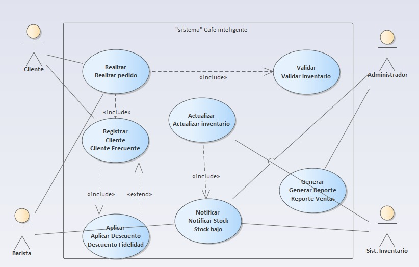
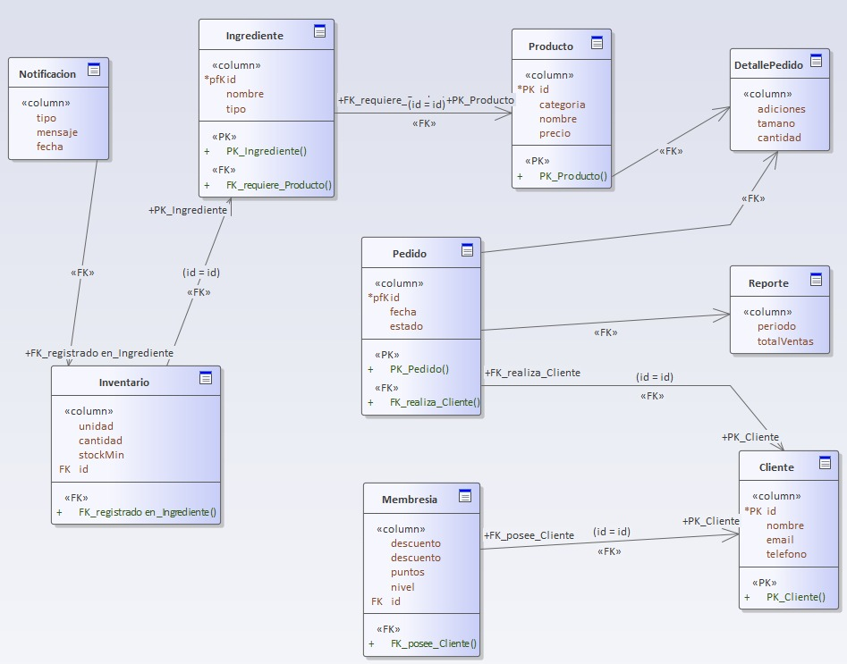
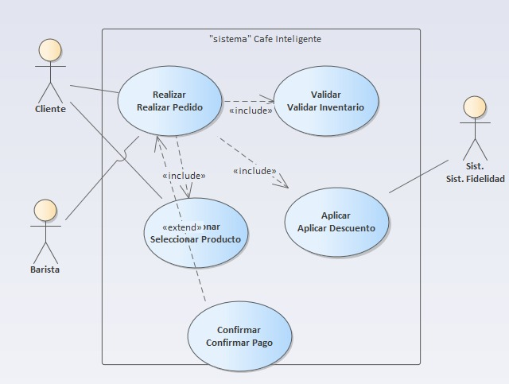
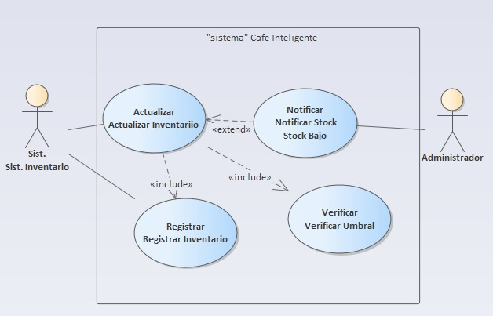
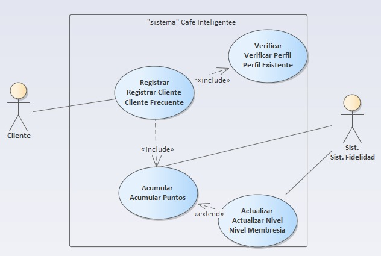
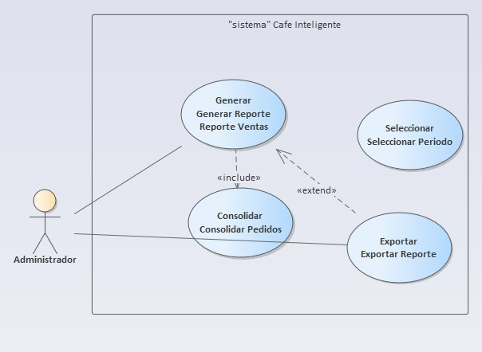
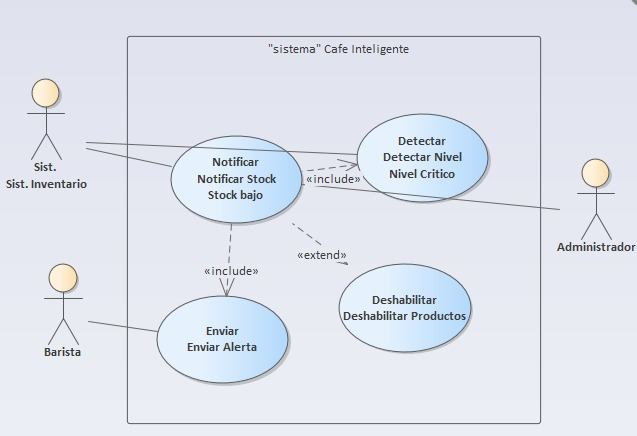

# cafeteriainteligente
- Diagrama general:

- Diagrama de clases:

- UC-01: Realizar pedido:

- UC-02: Actualizar inventario:

- UC-03: Registrar Cliente Frecuente:

- UC-04: Generar Reporte de Ventas:

- UC-05: Notificar Stock Bajo:
